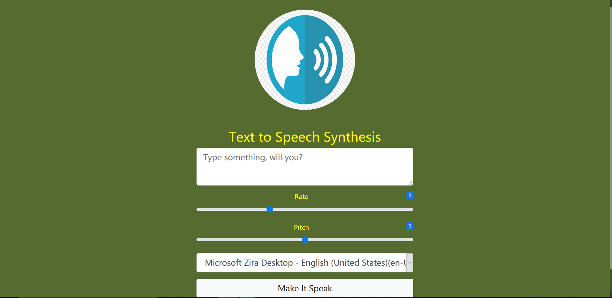

[]() 
[](https://github.com/vijethph/texttospeech-synth/issues)
[](https://github.com/vijethph/texttospeech-synth/graphs/contributors)
[](https://github.com/vijethph/texttospeech-synth/network)
[](https://github.com/vijethph/texttospeech-synth/stargazers)
[](https://github.com/vijethph/texttospeech-synth/blob/master/LICENSE)
[](https://forthebadge.com)
[](https://forthebadge.com)

<br />
<p align="center">
  <a href="https://github.com/vijethph/speechsynth">
    
  </a>

  <h2 align="center">Text-to-Speech Synthesis</h2>

  <p align="center">
    A javascript application that converts text typed into speech that can be heard.
    <br />
    <br />
    <a href="https://github.com/vijethph/texttospeech-synth/issues">Report Bug</a>
    ·
    <a href="https://github.com/vijethph/Best-README-Template/issues">Request Feature</a>
  </p>
</p>


<!-- TABLE OF CONTENTS -->
## Table of Contents

* [About the Project](#about-the-project)
  * [Built With](#built-with)
* [Getting Started](#getting-started)
  * [Prerequisites](#prerequisites)
  * [Installation](#installation)
* [Usage](#usage)
* [Contributing](#contributing)
* [License](#license)
* [Contact](#contact)
* [Acknowledgements](#acknowledgements)


<!-- ABOUT THE PROJECT -->
## About The Project

[](img/screenshot.jpg)

This is a javascript application that utilizes speech synthesis engine to convert text to speech. 


### Built With
This project is entirely built with the following components and languages:
* [Bootstrap](https://getbootstrap.com)
* [JQuery](https://jquery.com)
* [Javascript](https://en.wikipedia.org/wiki/JavaScript)
* [Popper JS](https://popper.js.org)


<!-- GETTING STARTED -->
## Getting Started

To get a local copy of the project up and running follow these simple steps.

### Prerequisites

A web browser that supports javascript is all that is required.


### Installation

1. Clone the repo
```sh
git clone https://github.com/vijethph/texttospeech-synth.git
```
2. Open the downloaded folder
```sh
cd texttospeech-synth
```
3. Open `index.html` in your browser.


<!-- USAGE EXAMPLES -->
## Usage

Simply type anything in the given text box. You can choose to alter Rate, Pitch and Speech Voice for the output.


<!-- CONTRIBUTING -->
## Contributing [](https://github.com/vijethph/texttospeech-synth/issues)


Contributions are what make the open source community such an amazing place to be learn, inspire, and create. Any contributions you make are **greatly appreciated**.

1. Fork the Project
2. Create your Feature Branch (`git checkout -b feature/AmazingFeature`)
3. Commit your Changes (`git commit -m 'Add some AmazingFeature'`)
4. Push to the Branch (`git push origin feature/AmazingFeature`)
5. Open a Pull Request


<!-- LICENSE -->
## License

Distributed under the GNU GPL License.


<!-- CONTACT -->
## Contact

Vijeth P H - [@vijeth](https://github.com/vijethph)

Project Link: [https://github.com/vijethph/repo_name](https://github.com/vijethph/repo_name)

## Thank You!
Made with ❤ in India.

If you like this project, please ⭐ this repo and share it with others 👍


<!-- ACKNOWLEDGEMENTS -->
## Acknowledgements
* [Mozilla Web Developer Docs](https://developer.mozilla.org/en-US/docs/Web/API/Web_Speech_API)
* [Img Shields](https://shields.io)
* [Choose an Open Source License](https://choosealicense.com)
* [GitHub Pages](https://pages.github.com)

